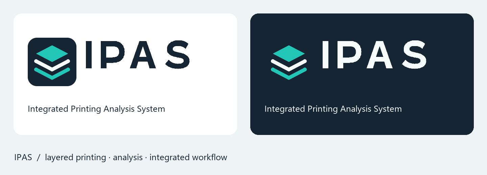

# IPAS · Integrated Printing Analysis System

## 한국어

통합 시스템의 공식 이름은 **IPAS**, 전체 명칭은 **Integrated Printing Analysis System**이다. 기존 PrintOps의 새 표시 이름이며 강도·G-code·가격 엔진의 패키지 이름이나 수치 모델을 바꾸는 작업은 아니다.

적층된 경로를 심볼로 표현했다. IPAS 워드마크는 직접 만든 벡터 윤곽으로 제공하며 별도 폰트를 내려받지 않는다. 전체 영문명에는 시스템 글꼴을 사용한다.

| 파일 | 용도 |
|---|---|
| `ipas-symbol.svg` | 심볼, 브라우저 SVG 아이콘 |
| `ipas-wordmark.svg`, `ipas-wordmark-light.svg` | 밝은 배경·어두운 배경용 워드마크 |
| `ipas-logo.svg`, `ipas-logo-light.svg` | 심볼·워드마크·전체 명칭 조합 |
| `favicon.ico` | 16·32·48·64·128·256px 브라우저·북마크 아이콘 |
| `favicon-16.png`, `favicon-32.png` | PNG 파비콘 대체 형식 |
| `apple-touch-icon.png` | 180px 홈 화면 아이콘 |
| `icon-192.png`, `icon-512.png` | 웹 앱 아이콘 |
| `site.webmanifest` | 앱 이름·아이콘·시작 주소 |
| `ipas-brand-kit.zip` | 위 자산과 미리보기 묶음 |

색상은 남색 `#152533`, 청록 `#21C6B7`, 밝은 색 `#F6FBFC`이다. 심볼 비율과 IPAS 철자를 유지한다. 기존 북마크의 저장된 제목은 브라우저가 관리하므로 사이트 제목 변경만으로 자동 변경되지 않을 수 있다.

호스트 적용은 [브랜딩 패치](../../docs/patches/ipas-branding-20261008.patch)를 이전 v0.5.24 소스에 적용하고, 위 12개 웹 자산을 호스트의 `app/web/`에 복사한 뒤 빌드한다. 운영 배포 결과는 [릴리스 기록](../../docs/ipas-branding-release-20261008.md)을 참조한다.

## English

The system is named **IPAS — Integrated Printing Analysis System**. It is the new display identity of PrintOps; numerical engines and package names retain their existing identities.

The original layered symbol represents deposited printing paths. IPAS letters are supplied as font-independent vector outlines. The full name uses system fonts. The kit includes light/dark SVG lockups, a multi-resolution ICO, PNG fallbacks, a 180px touch icon, 192/512px web app icons and a manifest. Colors: navy `#152533`, teal `#21C6B7`, off-white `#F6FBFC`.

Apply the [presentation patch](../../docs/patches/ipas-branding-20261008.patch) to the preceding v0.5.24 host source, copy the twelve browser assets into `app/web/`, and build. See the [release record](../../docs/ipas-branding-release-20261008.md) for verification. Previously saved bookmark titles are browser-managed and may retain their old text.
